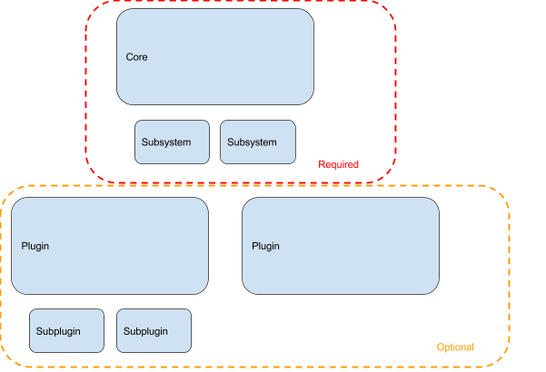
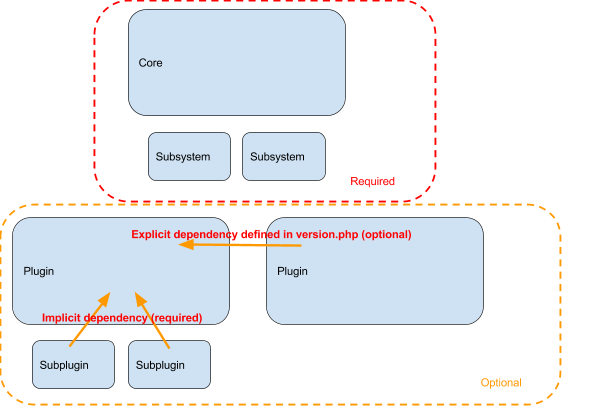
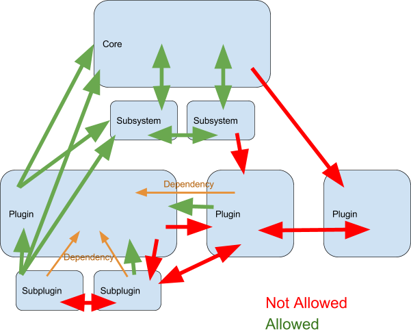
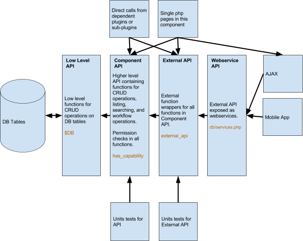

import { CodeBlock, TabItem, Tabs } from '@site/src/components';

## Components 

Moodle is code is split into different sections called `components`.

### Core 

The core libraries provide the base functionality that all other parts of moodle rely on. The component for core libraries is just referred to as `core`. Core code is not optional and cannot be safely removed without breaking Moodle. This means that it is always available and can be safely called from anywhere. Core code sits directly in the `/lib/` folder, or in the `/lib/classes/` folder for autoloaded core classes.

### Subsystems 

Subsystems are groups of related functions and classes that are part of core, but are logically grouped together. Often they are tied to a particular feature in Moodle, and sometimes can be disabled/enabled via a single config setting - but the code is never removed. It is safe to call core subsystems from anywhere in Moodle - but the functions may return an error to indicate that a feature has been disabled. Each core subsystem has a defined location where its code is grouped together. As of Moodle 3.1 there are 66 subsystems in core and the comprehensive list can be found here:

core_component::fetch_subsystems()

### Plugins 

Plugins are optional components in Moodle that extend its functionality. M in Moodle stands for `Modular` and most of the code in Moodle belongs to plugins. There are many different types of plugins, and each plugin type supports a different way to extend core functionality. Information on the available plugins types in Moodle can be found here:

### Plugin Types 

Vanilla Moodle package contains over 370 plugins. Additional plugins can be downloaded from the Plugins directory, or installed manually - and all plugins in Moodle are considered `optional`, even the ones included in vanilla package. This means that you can never assume a particular plugin will always exist on every Moodle site.

### Sub-plugins 

Some plugin types in Moodle support sub-plugins. This means that they can use other plugins to extend their own functionality. The only plugin types in Moodle that allow this are activity modules, editors, administration tools and local plugins. A sub-plugin can assume that its parent plugin is installed and does exist in Moodle - and can call its code directly, but it cannot assume anything about any other plugin or sub-plugin in Moodle.

### Dependencies 

Some plugins in Moodle depend on other plugins. An example of a dependency relationship is a plugin that `hosts` sub-plugins - each of the sub-plugins depends on the parent. Another example is where the dependency is explicitly defined in the version.php of the plugin.

## Communication Channels 

There are different ways to call code in Moodle. Most of them are listed here and described in detail later on:

- Direct php function calls
- External functions
- Javascript Modules (AMD)
- Templates
- get_string calls
- Event observers
- Component callbacks

## General rules for inter-component communications 

Because all plugins are optional, we can never rely on a plugin being installed in Moodle, unless there is a dependency relationship between the current component and the plugin. Core components and subsystems are always installed.
This means there are some strict rules about which types of communication are allowed in Moodle.

* It is always allowed to communicate with a `required` component. This includes core and all its subsystems.
* Any component is allowed to communicate with itself.
* It is allowed to communicate with another component if the calling component `depends` on the other component (see description of dependencies above).
* Not shown in the diagram - but the same rules apply to sub-plugins. They can communicate with their parent and any plugin that they explicitly (version.php) depend on.
* All other inter-component communications are forbidden.

### Direct php function calls 

This is the simplest type of communication - you know the name of a function so you just call it. Sometimes the name of the function is generated from the component name to allow different plugins to implement the same function with a different prefix or namespace.

### External functions 

External functions are functions defined in Moodle using the External API. These are functions suitable to call from webservices, or call directly from other parts of Moodle. Each external function follows a similar pattern:

* Parse and validate arguments
* Perform security checks and setup the theme and language (from the context)
* Call an internal API
* Return and validate the response

Calling external functions from another component in Moodle is no different to calling the php functions directly. This is allowed and encouraged.

One thing to think about when calling external functions from php though is that they are designed to be able to be called from a webservice, and so they will re-do all of the security checks and setup of the page theme and language that you have probably already done in your php page. To make sure this doesn’t cause side-effects (like changing the theme halfway through a page), always use the wrapper in `external_api::call_external_function()` instead of calling the external function directly.

Additional rules for calling external functions:
* Always use the external_api::call_external_function() wrapper when calling from php.

### Javascript Modules (AMD) 

It is possible through the Javascript loader to load an AMD module from any component and call its functions. This is a form of inter-component communication and must obey the strict rules for which components AMD modules can be loaded from.

### get_string 

It is possible to fetch strings from any component in Moodle. This is a form of inter-component communication and and must obey the strict rules for which components strings can be fetched from.

### Templates (Mustache) 

It is possible to fetch templates from any component in Moodle. This is a form of inter-component communication and and must obey the strict rules for which components templates can be fetched from.

### Event observers 

Any action in Moodle can trigger one or more `events`.

In Moodle it is possible to register observers for events. An observer is notified when an event happens and receives the data related to that event. An observer can only act on the information in the event. It cannot modify the data for the event or prevent the action from occurring. The component containing the observer is communicating with the component that declared the event class. The normal rules for inter-component communication apply.

In addition - event observers are a form of execution at a distance. It would be extremely difficult to read and maintain code heavily relying on event observers (especially if the observers perform actions that trigger more events).

Additional rules for event observers:
* Events are not allowed to be observed by core or a core subsystem (there are some currently wrong observers in core that should be removed).

### Callback methods (component_callback, get_plugins_with_function…) 

The most common way (but not the only way) to implement a callback is using the `component_callback()` function. This function works by looping over the installed plugins and calling a function from each plugin based on appending the component name to the supplied function name. It then expects the function to be defined either in the plugins lib.php file, or in an autoloaded location (but not in a class!).

[[Callbacks|List of callbacks in Moodle]]

## FAQ 

**Q: So how does plugin X call a function from plugin Y if they don’t depend on each other?**

A: By communicating through a core API.

**Q: What? Really?**

A: Anytime one plugin wants to communicate to one other specific plugin - it’s better to create a core API and channel all communication through that API. For example `assignment online text` uses the `Editor API` to add a rich text field to the form. It does not directly add an instance of `Atto` to the form. This allows either plugin to be replaced by a different, (hopefully better) plugin without changing the API or the other plugin. Remember, any plugin in Moodle is optional and may be removed in the future.

**Q: How do I know if there is an API I can already use?**

A: Existing callbacks are listed [[Callbacks|here]], major core APIs are listed [[Core_APIs|here]].

**Q: Can I change the data provided to a component_callback and maintain backwards compatibility.**

A: No it is not possible. You must implement a second callback with a new name.

**Q: Can I control the order in which plugins callbacks are executed?**

A: No it is not possible.

**Q: Can I find all the plugins implementing a callback?**

A: You can grep the code or create a test script that executes `get_plugins_with_function()`

**Q: How can I ensure the name for my new callback is unique?**

A: Check [[Callbacks|list of existing callbacks]]. Consider prefixing with the component name the callback is defined in - but existing code does not do this much.

**Q: Will my callback function be called even if my plugin is disabled?**

A: Yes - you must manually check if your own plugin is disabled before responding to a component callback.

**Q: I looked, there is no existing API I can use. How do I get a new one added to core?**

A: Create a tracker issue, post a patch (with unit tests) and explain your use case.

**Q: When should I create a callback and when should I use event observers?**

A: Event observers should not be added to facilitate plugin communication. They are about notifying the system that a real event occurred. Use an event observer only if:
* There is a real event occurring at the point you need to execute some additional code.
* You are not cheating the inter-component communication rules.
* You do not need to modify any of the data related to the event.

Otherwise add a new callback and execute for each plugin implementing it, using `get_plugins_with_function()`

**Q: Can I use one of the broadcast functions to provide a callback to some plugin types, but not all of them?**

A: It is better to allow all plugin types. Previously assumptions have been made about which plugins should be able to respond to an API and they have almost always turned out wrong.

**Q: Can create an API with callbacks that supports multiple stages?**

A: Not easily. You must create a separate callback for each stage and hope that consumers of your API create the correct function for each stage. An alternative is to create a callback that is expected to be returned an instance of an abstract class which defines your API.

**Q: Global functions are bad. Can I implement a callback in a class instead?**

A: No. Sorry.

## Ideal plugin design 

When building a new plugin for Moodle - it is good to think about how to best structure the code so that we separate our code into layers of functionality. This way we can provide a secure and comprehensive API that can be called from inside, or outside of our component, or from web-services (like the Mobile App or AJAX).

### Low Level API 

In this model, the DB tables are accessed through a low level API that knows about all the types, relationships and validation rules for the data in the tables. No permission checking is done at this level for performance and complexity reasons.

### Component API 

The component API defines all the things this plugin can do. Every function in the API should perform permission checks and validation on the parameters and return types and be covered by unit tests. This is the useful API that can be used by pages in your plugin, or called directly by another component in Moodle (only if it depends on this plugin).

### External API 

The external API is a single class that wraps each function in the Component API. By exposing all the functions in the Component API we allow people to build new interfaces and apps that we have never even thought about without requiring changes to our plugin. Covering each external function with a unit test ensures that all our parameters and return types are correctly specified. Note: External API functions can be called directly from other dependant plugins or sub-plugins in Moodle - but you must use the external_api::call_external_function to do so or you will introduce problems with theme, language and context.

### Webservice API 

This is not really an API, it is just a listing of all the functions in the external API in our plugins db/services.php file. This allows all these functions to be called from AJAX or webservices clients like the Mobile App.

## Editing images in this doc page 
This page was created from a google doc. To edit the images in this page - re-export them from the original document here: https://docs.google.com/document/d/1Z-vRWztT05bsb9b5KbBpLRP26oa3KTx3thB52_BW5VY/edit#heading=h.ardt51j6brj1
