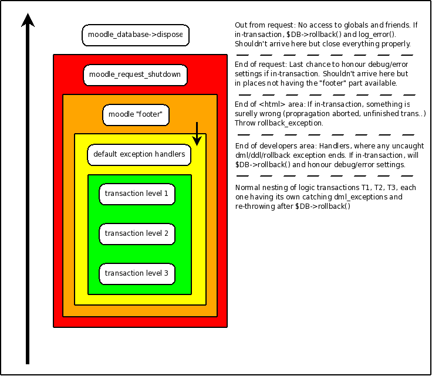

## General principles

1. No matter of the nested nature, they are really **"delegated transactions"** (so outer levels get the control over inner ones), so we are going to apply that naming to enforce the real concept
2. Code will **never** rely on rollback happening. It is only a measure to reduce (not to eliminate) DB garbled information
3. Any problem related with the use of transactions (unfinished ones, unbalanced, finished twice...) will end **always** with one transaction_exception that will **always** end performing one DB rollback
4. If one transaction (at any level) has been marked for rollback() there won't be any method to change it. Finally Moodle will perform the DB rollback
5. If one transaction (at any level) has been marked for commit() it will be possible to change that status to rollback() in any outer level
6. It will be **optional** to catch exceptions when using transactions, but if they are caught, then it is mandatory to mark the transaction for rollback()
7. Any explicit rollback() call will pass the exception originating it, i.e. rollback($exception) to be re-thrown
8. API will work in a natural and similar fashion to current recordsets one
9. We will start **recommending** to use InnoDB for 2.0 in environmental tests. Possibly, at some point in the future that will become a **must**. But **it is not** for now (be warned!)

## The API

1. All the handling must go, exclusively, to a `moodle_database` object, leaving real drivers only implementing (protected) the old begin/commit/rollback_sql() functions
2. One array of objects of type `moodle_transaction` will be stored / checked from `$DB`
3. `$DB` will be the responsible to instantiate / accumulate / pair / compare `moodle_transaction`s
4. Each `moodle_transaction` will be able to set the global mark for rollback. Commit won't change anything
5. Inner-most commit/rollback will printout one complete stack of `moodle_transaction`s information if we are under `DEBUG_DEVELOPER` and new setting `delegatedtransactionsdebug` is enabled
6. Normal usage of the moodle_transaction will be:

    ```php
    $transaction = $DB->start_delegated_transaction();
    // Perform some $DB stuff
    $transaction->allow_commit();
    ```

7. If, for any reason, the developer needs to catch exceptions when using transactions, it will be mandatory to use it in this way:

    ```php
    try {
        $transaction = $DB->start_delegated_transaction();
        // Perform some $DB stuff
        $transaction->allow_commit();
    } catch (Exception $e) {
        //extra cleanup steps
        $transaction->rollback($e); // rethrows exception
    }
    ```

8. In order to be able to keep some parts of code out from top transactions completely, if we know it can lead to problems, we can use:

    ```php
     $DB->transactions_forbidden(); // Instant check to confirm we aren't using transactions in this point. Will throw exception if transaction is found.
    ```

## The Flow



1. Any default exception handler will:
    1. Catch uncaught transaction_exception exceptions
    2. Properly perform the DB rollback
    3. debug/error/log honouring related settings
    4. inform with as many details as possible (token, place... whatever)
2. Any "footer" (meaning some place before ending `<html>` output) will:
    1. Detect "in-transaction" status
    2. Let execution continue, transaction is automatically rolled back in `$DB->dispose()`
    3. inform with as many details as possible (token, place... whatever)
3. `$DB->dispose()` will:
    1. Detect "in-transaction" status
    2. log error (not possible to honour settings!)
    3. Properly perform the full DB rollback

## Related tasks

1. Move this to MoodleDocs and publicly in Dev Forum
2. Implement fulfilling current specs / review / test iterations
3. Re-enforce in Docs, phpdocs, everywhere, the "Code will *never* rely on rollback happening" and the "delegated" nature of the whole thing
4. Be extremely careful about any use of delegated transactions until we get used to them, reviewing them in core often
5. Point somewhere about the move to InnoDB, pros/cons, migration process... to have it documented
