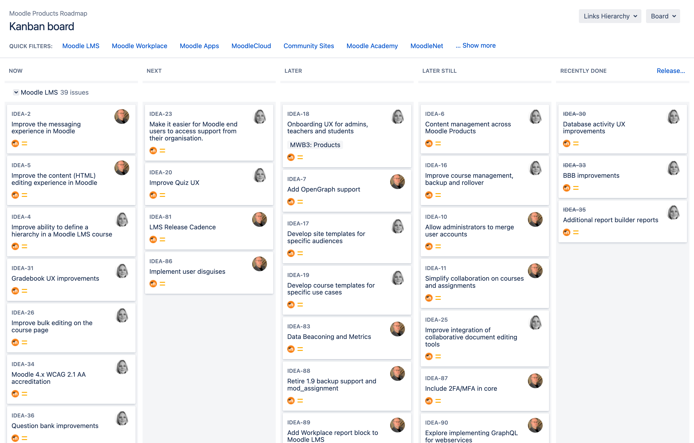

Our Moodle Products roadmap is designed to provide visibility on the development priorities of the Moodle HQ Product teams and covers all the products in our open source learning platform portfolio, consisting of Moodle LMS, Moodle Workplace, MoodleCloud, MoodleNet, Moodle Apps, Moodle Community Sites, and Moodle Academy.

import Link from '@docusaurus/Link';

<Link
  to="https://tracker.moodle.org/secure/RapidBoard.jspa?rapidView=260&projectKey=IDEA"
  title="View the current Moodle Roadmap on the Tracker"
  >

  

</Link>

## What is a roadmap and why is it important?

The Moodle Products roadmap is our shared source of truth at Moodle HQ which we use to define our product direction, priorities and progress.

It is the plan that aligns our teams around common goals and outcomes.

## Who creates the roadmap and how often does it get updated?

The Moodle HQ Product teams curate every idea on the roadmap during our quarterly planning processes.

Every three months, the team takes a week off development to complete detailed planning of the work to be delivered during our next increment and map out our areas of focus for a rolling 12 to 18 months ahead.

Before each planning week, our Product leads conduct engagement sessions with our stakeholders and review a range of data sources to collect ideas and prioritise the roadmap.

## Where do the ideas come from?

We curate our ideas from a wide range of sources including;

1. Moodle HQ Product teams continuously review issues created by our users who can log new feature requests and ideas for improvements in our [public tracker](https://tracker.moodle.org/projects/MDL/issues/MDL-75914?filter=allopenissues). The issues can also be voted on by our community to mark interest in the suggestions made by others.
1. Our [public forums](https://moodle.org/course/) are available to all community members to obtain support and discuss ideas. They are a rich source of feedback that is used to inform our roadmap.
1. The official voice of our users is the [Moodle Users Association](https://moodleassociation.org/), a group of passionate Moodlers from around the world who suggest and vote for new ideas to be delivered at each new release of the Moodle LMS platform.
1. Many of our Products have Product Advisory Groups (PAGs) which meet on a regular basis to help inform the priorities of our roadmap ideas. These groups are formed by representatives from our user base and our [Moodle Partners](https://moodle.com/solutions/certified-service-providers/) network with whom we work closely to define the needs of our markets in education and workplace learning.
1. Each of our products offers the opportunity to provide feedback via short questionnaires, we review the responses regularly and use the insights to shape our thinking.
1. All members of the Moodle HQ team are encouraged to share their thoughts on the future of our open source platform. From new innovations to maintenance tasks, every idea is welcomed and is considered for prioritisation during our planning process.

## How should the roadmap be interpreted?

Our roadmap is not strictly speaking a delivery plan - we don't explicitly provide dates for each of our deliverables. The reason for this is that we know that the world around us is changing at pace, new ideas are constantly emerging and urgent issues pop up from time to time.

Rather, we publish our roadmap using the 'Now, Next, Later' methodology, detailing the current order we plan to follow in delivering new features and enhancements across our product portfolio.

The purpose of sharing the roadmap is to drive understanding in the community on where Moodle HQ's priorities lie. Our teams are often asked 'Why are you not working on X, it is really important', and the answer to that question is most frequently 'We agree that X is really important, but right now A is more important to more of our users and the future of our platform'.

That's because, at Moodle HQ, we have to balance the needs of our broad range of stakeholders and think long-term about our products. The point of sharing the roadmap is to make our prioritisation balancing act more transparent.

## What are Moodle HQ's current priorities?

Moodle is a platform that is dedicated to empowering educators, trainers and learners all around the world. Our goal is to create solutions that make learning accessible to everyone, regardless of their location or financial situation.

To achieve this goal, the areas we will focus on when developing our future versions of Moodle are:

### Unlocking Creativity

We aim to empower educators and learners to shape their learning according to their imagination and aspirations, leading to a more inclusive and personalised educational experience. This will be achieved through:

- Optimisation of our current course interface and activities
- Introduction of new course experiences
- Diversification of content creation options

### Facilitating Collaboration

We will focus on enabling supportive and connected learning environments by continuously improving Moodle's ability to integrate and collaborate effectively with other solutions and leverage common standards. This will be achieved through:

- Supporting plugin development
- Leveraging of common standards
- Capitalising on open source solutions

### Optimising outcomes

Providing our users with tools that optimise their efforts is paramount. We aim to create a toolset that not only reduces the time and cost of managing and creating courses but also helps learners overcome challenges more effectively. This will be achieved through:

- Ecosystem support for advanced analytics
- A more modern & leaner platform
- New tools to support learners

## Where can I find out more?

To see all the details for our upcoming developments, you can visit the roadmap at any time simply by logging into Tracker and [viewing our public board](https://tracker.moodle.org/secure/RapidBoard.jspa?rapidView=260&projectKey=IDEA).

To stay up to date with all the latest developments, please keep an eye out for our Showcase Shorts, a bird's eye view of our latest design and development outcomes, announced on moodle.org [Community News](https://moodle.org/news) every few weeks.

To find out more about Moodle release time-frames, please visit our [Releases](../releases.md#general-release-calendar) page.
