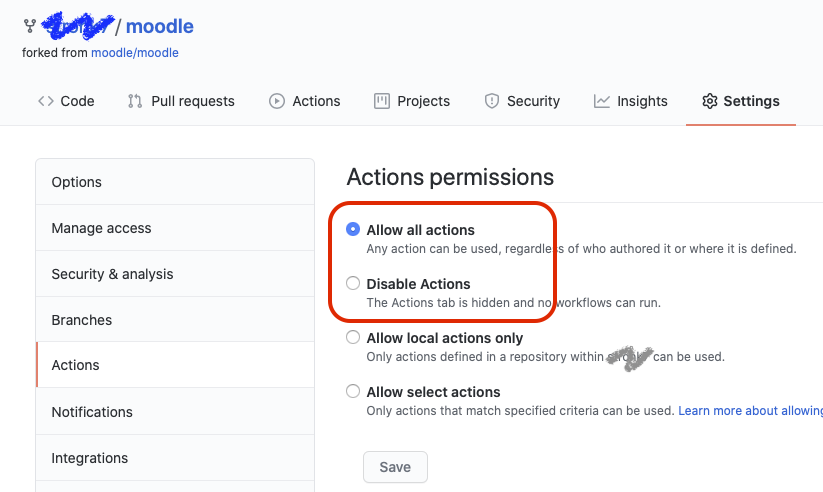

## Moodle core

### Background

Moodle is regularly tested against a matrix of Databases, PHP Versions, and operating systems, however many developers do not have the resources available to run on many of these combinations before pushing an issue for integration as they are time-consuming to both set up and to run.

There are many Continuous Integration tools available to developers, and [GitHub Actions](https://github.com/features/actions) (usually named simply "GHA") is just one of those available to the Open Source community.

Since November 2020 (Moodle 3.5.16 and up), Moodle includes a GitHub Actions configuration file in its repository. This configuration file configures and controls a GitHub build across a matrix of testing environments. This allows developers pushing patches to Moodle to have their code unit tested before it reaches integration. The hope is that the availability of this integration should reduce the number of unit test failures seen during Integration.

:::note

Moodle HQ uses the Jenkins CI platform and this should be seen as the [canonical CI server for Moodle](https://ci.moodle.org/). The GitHub Actions integration aims is to provide early warning to developers of any issues with their code.

:::

### Usage

GitHub Actions are available and enabled by default for all public repositories at GitHub. You can enable or disable them from your GitHub fork of the moodle.git repository by navigating to the Settings tab, and selecting Actions from the side menu. Please use the "Allow all" option as far as the integration reuses actions from different sources.

For the purpose of this documentation, it is assumed that you are pushing to a public Moodle repository on GitHub. Other integrations are supported, but the service available from GitHub Actions is only available to GitHub public repositories.

### How do I start a build?

Whenever you push a change to any branch in your repository... a build will be queued and executed. You can see how all your builds are progressing by visiting your moodle.git clone page at GitHub, then selecting the actions tab. From there you can filter by branch, by status, access to every build, see failures, relaunch jobs...

You will receive notifications (by email or web) whenever a build fails - this can be configured from your account's notification settings. If your branches match the branch names in any issue in the Tracker, the corresponding pass/fail badges will be shown on that issue . Clicking on them you will access straight to the job details at GitHub.

And that's all, pretty nice, simple and effective.

### How do I configure the PHPUnit executions

Since Moodle 3.11.8 and 4.0.2, it's possible to configure the PHPUnit executions by creating a [GitHub repository secret](https://docs.github.com/en/actions/security-guides/encrypted-secrets#creating-encrypted-secrets-for-a-repository) named `phpunit_options`. Just setup its value to the options that you want to pass to PHPUnit and they will come into effect for all runs. For a list of [PHPUnit available options](https://phpunit.readthedocs.io/en/9.5/textui.html#command-line-options) use the `vendor/bin/phpunit --help` command.

## Moodle plugins

See [the instructions in the Moodle Plugin CI repository](https://moodlehq.github.io/moodle-plugin-ci/#github-actions).
