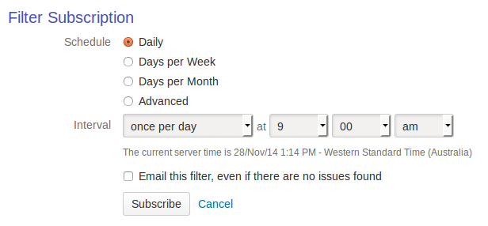

## Searching

### Quick search

On every tracker page you can find search box. Quick search is much more powerful than you might think.

Examples of the quick searches:

| Quick search | Advanced search equivalent | Description ||
| --- | --- | --- |
| `MDL Unresolved Bug abra cadabra`  | Find all unresolved Bugs in Moodle project that contain words `abra cadabra` | `project = MDL AND issuetype = Bug AND resolution = Unresolved AND text ~ "abra cadabra"`  |
| `my Unresolved` | `resolution = Unresolved AND assignee = currentUser()` | Find all ongoing issues assigned to me |

Quick search can pick up many other keywords, see more information on page [Using quick search](https://confluence.atlassian.com/display/JIRA062/Using+Quick+Search)

### Advanced search

To get here either enter something in quick search or go to the link [Tracker search page](https://tracker.moodle.org/issues/?jql=) and switch it to “Advanced” mode.
Now you can enter queries in the Jira Query Language (JQL). Use as many AND, OR and parenthesis as you want. Some examples and interesting subqueries:

| JQL | Description |
| --- | --- |
| `project = MDL` | only issues inside project Moodle |
| `resolution = Unresolved` | Best way to search for open issues |
| `type in (Improvement, "New Feature")` | |
| `votes > 50` | |
| `component in (Assignment, Gradebook)` | where component is either Assignment or Gradebook |
| `component = Assignment AND component = Gradebook` | where both Assignment and Gradebook are listed as components |
| `labels = patch` | issues containing particular label |
| `labels is empty OR labels not in (triaged, triaging_in_progress)` | issues NOT containing particular label(s) |
|  [`updatedDate > -7d`](https://tracker.moodle.org/issues/?jql=updatedDate%20%3E%20-7d) | updated in the last week |
|  [`assignee = currentUser() AND resolution = Unresolved`](https://tracker.moodle.org/issues/?jql=assignee%20%3D%20currentUser%28%29%20AND%20resolution%20%3D%20Unresolved) | open issues where you are an assignee |
| [`reporter = currentUser()`](https://tracker.moodle.org/issues/?jql=reporter%20%3D%20currentUser%28%29) | issues reported by you |
| [`Participants  = currentUser()`](https://tracker.moodle.org/issues/?jql=Participants%20%20%3D%20currentUser()) | issues where you commented, edited or otherwise participated |
| [`"Component watchers" = currentUser() and resolution = Unresolved`](https://tracker.moodle.org/issues/?jql=%22Component%20watchers%22%20%3D%20currentUser()%20and%20resolution%20%3D%20Unresolved) | open issues in the components where you are an automatic watcher (only tracker admins can assign automatic watchers) |
| `assignee in membersOf("hq-developers"`) | issues assigned to members of hq-developers group |
| [`status changed to "Waiting for peer review" before startofday(-7) and status = "Waiting for peer review"`](https://tracker.moodle.org/issues/?jql=status%20changed%20to%20%22Waiting%20for%20peer%20review%22%20before%20startofday%28-7%29%20and%20status%20%3D%20%22Waiting%20for%20peer%20review%22`)` | issues waiting for peer review for over a week |
| `status WAS NOT "Development in progress"  BEFORE "2011/02/02"` | |
| `issue in linkedIssues("MDL-12345")` | issues linked to particular issue |
| `issue in linkedIssues("MDL-12345","duplicated by")` | Returns all the issues directly and indirectly duplicated by 'MDL-12345'. i.e. if there is 'MDL-12222'  duplicated by 'MDL-12345'   and 'MDL-11111'  duplicated by 'MDL-12222', both 'MDL-11111' and 'MDL-12222' will be returned as search results. |
| [`issue in favouriteIssues()`](https://tracker.moodle.org/issues/?jql=issue%20in%20favouriteIssues%28%29) | issues that you marked as favourite |

More documentation on [https://confluence.atlassian.com/jirasoftwareserver071/advanced-searching-800707146.html Advanced searching]

## Using filters

### Creating a filter

1. In tracker, select **Issues** > **Search for Issues**.
2. Create a search and run the search query by pressing **Enter** or clicking the **Search** button to the right of the search box. For example, this is the query for untriaged issues in your component:

    ```
    component in (Assignment) AND resolution = Unresolved AND (labels is EMPTY OR labels not in (triaged)) ORDER BY created DESC
    ```

3. When the search query results are displayed, click the **Save as** button and give it an appropriate name. For instance, for the previous query you can use "Untriaged Assignment issues".

4. Now you can quickly access your filters but also you can subscribe to it, Click on **Details**:

5. You can also add **New subscription** if you want to be notified periodically about new issues in any of the filters you've created.


:::tip Manage filters and subscriptions

You can manage your filters and subscriptions on [Manage filters](https://tracker.moodle.org/secure/ManageFilters.jspa) page.

Watchers automatically receive notifications about the updates of the issues they are watching. Using filter subscription you can either monitor issues that you are not watching or monitor issues that are in particular state and were not updated.

:::

### Adding a filter in a gadget to your dashboard

1. In tracker, click **Dashboards** > **Manage Dashboards** and access to any of your dashboards or create one.
2. Click **Add gadget**.
3. Find the **Filter Results** gadget.
4. Click **Add it Now**.
5. Click **Finished**.
6. In the **Saved Filter** input, search for and select your newly created filter.
7. Click **Save**.

:::info

If you're using the previous query for untriaged assignment issues, the most recent untriaged issues should appear in reverse-date order.

:::

### Useful queries

- [Issues reported by me not against current versions](https://tracker.moodle.org/issues/?jql=project%20%3D%20mdl%20and%20resolution%20%3D%20unresolved%20and%20type%20in%20%28bug%29%20and%20%22Affected%20Branches%22%20!~%20MOODLE_310_STABLE%20and%20%22Affected%20Branches%22%20!~%20MOODLE_311_STABLE%20and%20reporter%20%3D%20currentUser%28%29) - make sure that you keep track of your own issues!
- [Untriaged issues in my components](https://tracker.moodle.org/issues/?jql=component%20in%20%28componentsLeadByUser%28%29%29%20AND%20resolution%20%3D%20Unresolved%20AND%20updatedDate%20%3E%20-14d%20AND%20project%20%3D%20MDL%20AND%20%28%20labels%20is%20EMPTY%20OR%20labels%20not%20in%20%28triaged%2C%20triaging_in_progress%29%29%20ORDER%20BY%20updatedDate%20ASC) (works only for component leads)
- [Waiting for peer review for 21 days](https://tracker.moodle.org/issues/?jql=status%20changed%20to%20%22Waiting%20for%20peer%20review%22%20before%20startofday(-21)%20and%20status%20%3D%20%22Waiting%20for%20peer%20review%22)
- [Integrated this week](https://tracker.moodle.org/issues/?filter=19324) - subscribe to this filter on Fridays and keep yourself up-to-date with what is happening in Moodle
